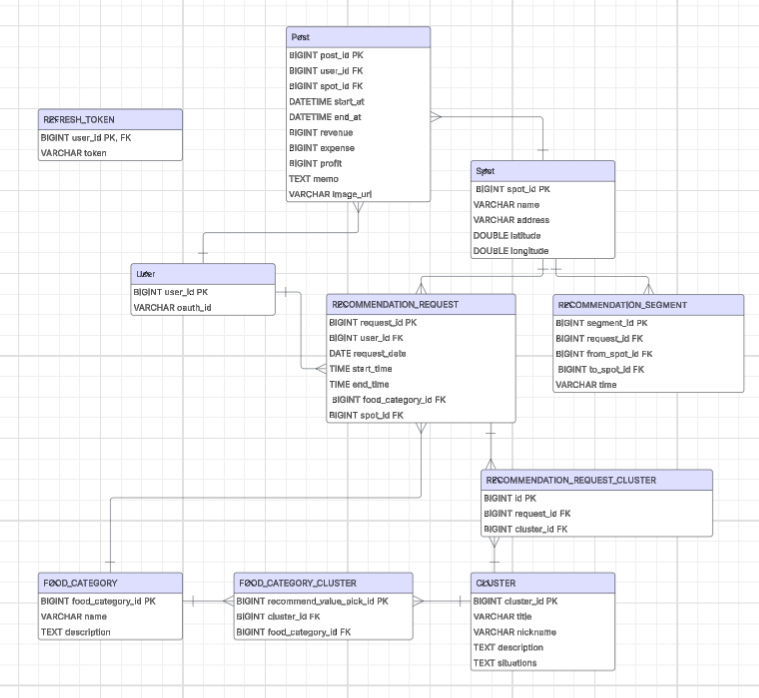

# 🚀 사장님 여기요 (Boss Over Here)

푸드트럭 사장님들의 **수익 최적화**를 돕는 맞춤형 서비스  
실시간 인구 유동 데이터와 AI 경로 추천, 매출·지출 기록 관리 기능 제공

---

## 📖 목차

1. [프로젝트 개요](#프로젝트-개요)
2. [배경 및 동기](#배경-및-동기)
3. [ERD](#erd)
4. [API 문서](#api-문서)
5. [운영 환경 및 배포 인프라 구성](#운영-환경-및-배포-인프라-구성)

---

## 프로젝트 개요

- **서비스명**: 사장님 여기요
- **목표**:
    - 푸드트럭 허가 구역 정보 제공
    - 매출·지출 기록 관리
    - AI 기반 최적 영업 경로 추천

---

## 배경 및 동기

  
푸드트럭은 진입 장벽이 낮고 기동성이 뛰어나 **젊은 창업자**에게 인기지만,  
서울연구원 정책보고서에 따르면
> 지난 10년간 푸드트럭 폐업율 **58.6%**  
> – 두 명 중 한 명꼴로 수익성 확보에 어려움을 겪음

이에 **사장님 여기요**는
- 허가 구역 정보 제공
- 매출·지출 기록 관리
- AI 기반 경로 추천

을 통해 사장님들의 **편의**와 **수익 최적화**를 돕고자 합니다.

---

## ERD

원본은 아래 Lucidchart 링크를 참고하세요.

[🔗 ERD 다이어그램 (Lucidchart)](https://lucid.app/lucidchart/ed55f3fd-eaac-4638-9348-9ac9b374edb2/edit?invitationId=inv_cbed137e-9123-48b5-b972-f1ceffdb2590)

---

## API 문서

- 인증 회원 관리

- 게시글 (Post) API

- 푸드트럭 허가 구역 (Spot) API

- 추천 (Recommendation) API

- 음식 및 클러스터 목록 조회(Food Category) API

---

## 운영 환경 및 배포 인프라 구성

- EC2 인스턴스: Nginx + Docker 컨테이너 (Spring Boot)

- RDS (MySQL): 보안 그룹 3306 오픈

- S3: 이미지 저장용 버킷 (버킷 정책으로 s3:GetObject 공개 권한 설정)  

- 도메인 연결: 내도메인.한국 → EC2 Elastic IP (DNS A 레코드)

- SSL: Certbot + Nginx 자동 갱신

원본은 아래 링크를 참고하세요.

[🔗 시스템 아키텍쳐 (draw.io)](https://drive.google.com/file/d/1uYdEtw08h7nk301LgZtgRsZTPE2sWMhu/view?usp=sharing)
